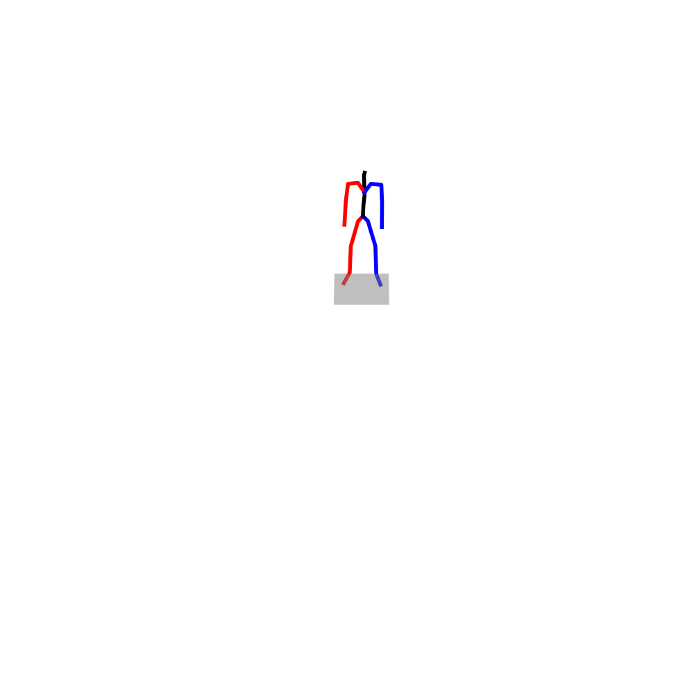

# Motion-Agent: A Conversational Framework for Human Motion Generation with LLMs (ICLR 2025) 

<p align="center">
    <a href="https://arxiv.org/abs/2405.17013"></a>
    <a href="https://knoxzhao.github.io/Motion-Agent/"></a>
  </p>

## Overview

While previous approaches to 3D human motion generation have achieved notable success, they often rely on extensive training and are limited to specific tasks. To address these challenges, we introduce **Motion-Agent**, an efficient conversational framework designed for general human motion generation, editing, and understanding. Motion-Agent employs an open-source pre-trained language model to develop a generative agent, **MotionLLM**, that bridges the gap between motion and text. This is accomplished by encoding and quantizing motions into discrete tokens that align with the language model's vocabulary. With only 1-3\% of the model's parameters fine-tuned using adapters, MotionLLM delivers performance on par with diffusion models and other transformer-based methods trained from scratch. By integrating MotionLLM with GPT-4 without additional training, Motion-Agent is able to generate highly complex motion sequences through multi-turn conversations, a capability that previous models have struggled to achieve. Motion-Agent supports a wide range of motion-language tasks, offering versatile capabilities for generating and customizing human motion through interactive conversational exchanges.

## Updates

- [2025/02/19] Demo and evaluation code are available.
- [2025/02/06] Motion-Agent is accepted to ICLR 2025.
- [2024/10/08] Motion-Agent paper is available.
- [2024/05/28] Original version MotionLLM paper is available.

## Citation
If you find our work useful, please cite us. The BibTeX is as follows.
```
@article{wu2024motion,
  title={Motion-Agent: A Conversational Framework for Human Motion Generation with LLMs},
  author={Wu, Qi and Zhao, Yubo and Wang, Yifan and Liu, Xinhang and Tai, Yu-Wing and Tang, Chi-Keung},
  journal={arXiv preprint arXiv:2405.17013},
  year={2024}
}
```

## Getting Started

### Environment Setup
```bash
conda create -n motionagent python=3.10
conda activate motionagent
pip install -r requirements.txt
```
### Download Motion-Agent ckpts
Download Motion-Agent ckpts.
```bash
bash prepare/download_ckpt.sh
```
### Download Glove and extractor
Download evaluation models and gloves for evaluation.
```bash
bash prepare/download_glove.sh
bash prepare/download_extractor.sh
```

### Prepare the LLM backbone
We use Google Gemma2-2B as MotionLLM's backbone. Please grant access from [huggingface](https://huggingface.co/google/gemma-2-2b) and use `huggingface-cli login` to login.

## Demo
We provide an interactive demo for Motion-Agent that runs in your terminal. You will need to setup your own Azure OpenAI API key and endpoint.
To start the demo:

```bash
python demo.py
```

### Example Prompts
Here are some examples of what you can ask Motion-Agent:

1. **Motion Generation**
```bash
Generate a motion of a person runs forward and then does a backflip.
```

2. **Motion Reasoning**
```bash
Why is the person doing this? ./assets/motion_example.npy
```
<details>
<summary>Preview of the example motion</summary>


</details>

Note: For motion reasoning, make sure your motion file is in the correct `.npy` format (HumanML3D format) and exists in the specified path.

## Evaluation
To get the full data of HumanML3D, please follow the instruction in [HumanML3D](https://github.com/EricGuo5513/HumanML3D).
```bash
python eval_mllm.py
```


## Acknowledgements
We would like to thank the following open-source projects for their contributions to our codes:
[T2M-GPT](https://github.com/Mael-zys/T2M-GPT),
[NExT-GPT](https://github.com/NExT-GPT/NExT-GPT),
[text-to-motion](https://github.com/EricGuo5513/text-to-motion).


